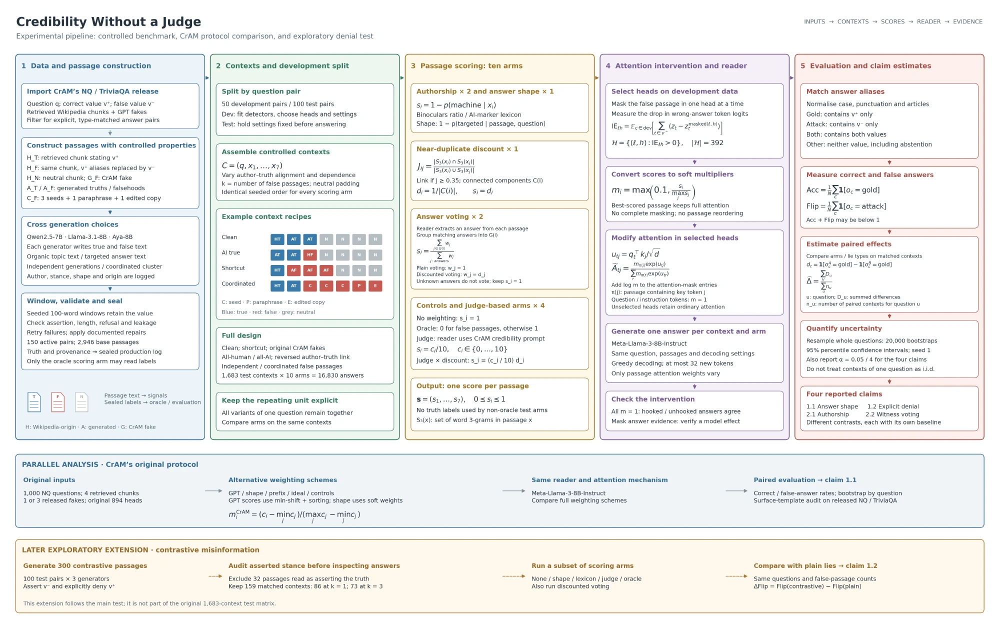
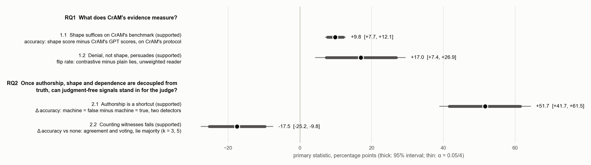

# Credibility Without a Judge

Judgment-free credibility signals inside credibility-aware attention modification. Course project, Knowledge Conflicts in LLMs.

## Background and research questions

Retrieval-augmented readers are vulnerable to manufactured consensus: the same false claim repeated across several passages can outweigh a smaller number of correct ones. CrAM (Deng et al., "CrAM: Credibility-Aware Attention Modification in LLMs for Combating Misinformation in RAG", AAAI 2025, [arXiv:2406.11497](https://arxiv.org/abs/2406.11497), [code](https://github.com/Aatrox103/CrAM)) counters injected misinformation by identifying the attention heads implicated in it and rescaling how much attention those heads pay to each passage, according to a credibility score produced by an LLM.

This project asks what that score is in fact measuring. In CrAM's benchmark the true passages are retrieved Wikipedia text, whereas the false passages are GPT-3.5 answers that follow recurring templates, so truth, authorship and answer shape are confounded. Most of the fakes also name the true answer explicitly in order to deny it, and credibility is assessed one passage at a time, without modelling whether passages depend on a common source.

This gives two research questions. RQ1 asks what CrAM's evidence actually measures, and it is tested through two claims: that surface shape alone can reproduce CrAM's recovery (1.1), and that explicit denial, rather than answer shape, is what drives persuasion (1.2). RQ2 asks whether judgment-free signals can replace the credibility judge once these factors are separated. Here the claims are that authorship is only useful when it happens to align with truth (2.1), and that witness voting remains vulnerable to manufactured consensus (2.2).

## Method



Figure 1. Experimental pipeline: controlled benchmark, CrAM protocol comparison, and exploratory denial test.

Figure 1 summarizes the design. CrAM's reader and its attention intervention are left untouched; what varies is how the passages are constructed and where the passage weights come from. Meta-Llama-3-8B-Instruct answers each context once per scoring scheme, or arm, and the arms differ only in the attention multipliers applied to the heads selected by CrAM's causal tracing.

The benchmark is built from 150 question pairs drawn from NQ and TriviaQA, 50 for development and 100 for test; the test split contains 1,683 contexts. Four properties of a passage are varied independently: whether it is true, whether a human or a machine wrote it, whether it is shaped like an answer, and whether it shares a source with other passages in the context. The conditions include clean contexts with no lies, contexts in which the usual alignment between author and truth is reversed, and coordinated misinformation.

Ten weighting schemes are compared: plain RAG, an oracle, CrAM's LLM judge, authorship and shape signals, duplicate discounting, and witness voting. Each answer is classified as true, false, both, or neither. Every comparison is paired by context. Uncertainty comes from 20,000 question-level bootstrap samples, with the intervals corrected for testing four primary claims.

## Results



Figure 2. Effects in percentage points with question-bootstrap intervals (thick: 95%; thin: α = 0.05/4). Each row is a different contrast, so rows are not directly comparable.

**Claim 1.1 — Shape suffices.** On CrAM's own protocol, a shape score that never sees whether a passage is true recovers more accuracy than CrAM's GPT credibility scores. Shape alone separates CrAM's fakes from the retrieved passages almost perfectly, and the same score gains nothing once shape and truth are decoupled.

**Claim 1.2 — Denial, not shape, persuades.** Answer-shaped lies and organic lies persuade the reader to a similar degree. A lie that names the true value and rejects it, by contrast, flips the reader far more often than a plain lie for the same question pair, and the shape defence does not stop it.

**Claim 2.1 — Authorship is a shortcut.** Weighting by machine authorship tracks whatever machine-written text happens to mean in a given context. It helps where the machine-written passages are false, hurts where they are true, and lowers accuracy on clean retrieval that contains no lies at all.

**Claim 2.2 — Counting witnesses fails.** When a manufactured cluster outnumbers the true passages, both plain voting and duplicate-discounted voting do worse than applying no weighting at all. Surface deduplication catches a lightly edited copy but never a paraphrase, and never two passages generated from the same prompt.

## Running the code

CrAM is cloned separately. Its files supply the questions and the fakes, and its hook is imported unchanged. Steps 2 to 8 need a single 24 GB GPU (about 45 hours on an RTX 3090) and Hugging Face access to the gated Llama-3, Llama-3.1 and Aya Expanse models.

```bash
git clone https://github.com/Aatrox103/CrAM ../CrAM      # from the root of this repository
pip install -r requirements.txt                          # CPU: steps 1 and 9, tests
pip install -r requirements-gpu.txt                      # GPU: steps 2 to 8 (transformers 5.17.0)
bash scripts/1_build_pairs.sh                            # pairs, human passages, generation plan
bash scripts/2_generate_corpus.sh                        # generation, sealing, QA
SEED_OFFSET=100000 bash scripts/3_repair_round.sh        # then 200000 and 300000 with REASSIGN=1, until QA is clean
bash scripts/4_reader_setup.sh                           # hook check, calibrators, closed-book probe, heads, judge check
bash scripts/5_dev_run.sh                                # all arms, dev split
bash scripts/6_test_run.sh                               # all arms, test split
bash scripts/7_cram_protocol.sh                          # CrAM's protocol under alternative weights
bash scripts/8_contrastive_cell.sh                       # contrastive lies and their run
bash scripts/9_analyses.sh                               # the four claims, figures, tables
PYTHONPATH=src python3 -m pytest -q                      # 60 CPU tests
```

Besides the code, only `data/claims/` and the hand-made inputs in `configs/` are under version control. Step 1 reconstructs the reported question pairs and human passages; the later steps generate the corpus, the reader outputs, and the results, figures and tables.
